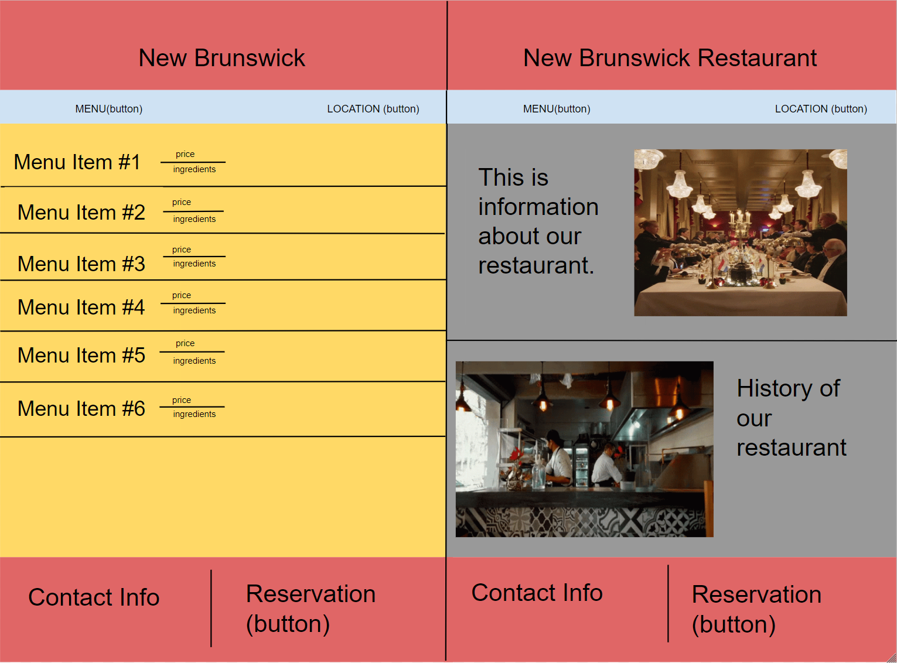
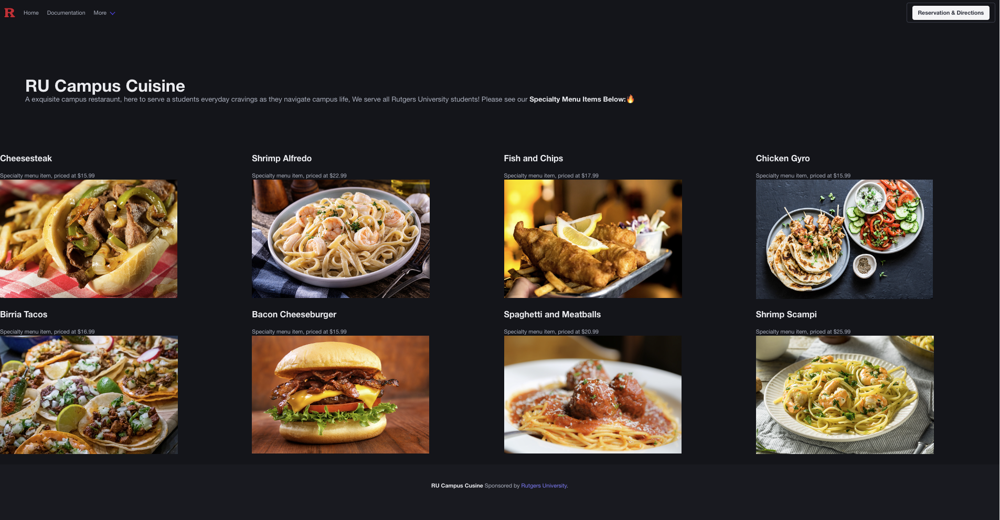
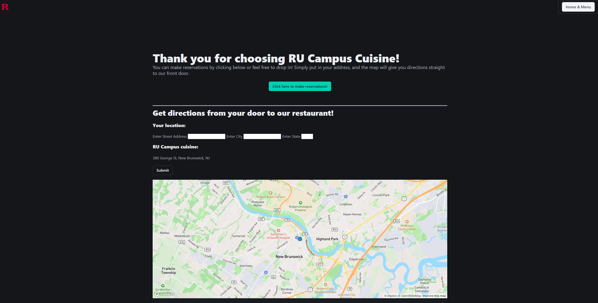

# R-U-Campus Cuisine (Group F)
Project by Greg Bailey, Destiny Jenkins, and Rickey Zheng.

## About
This is a website for a restaurant that was created by us. It allows the user to view the menu as well as allowing the user to make reservations and get directions to our restaurant from any address.

## User Story

* As a user, I want to use the website to look at items on the menu.
* As a user, I want to make reservations on the website.
* As a user, I want directions my house to the restaurant.

## Acceptance Critera

* It is done when I visit the website, and the menu shows up with pictures and prices.
* It is done when I click on the Rutgers logo, and it takes me to the Rutgers official website.
* It is done when I click on the "RESERVATION & DIRECTIONS" button, and it takes me to a page where I can make reservations and get directions to the restaurant.
* It is done when I fill out the information for directions, it shows me the distance and step-step directions to the restaurant.
* It is done when I click on "MAKE RESERVATIONS", and a modul pops up for me to put my information in.
* It is done when I fill out the information to make a reservation, and it shows all the information I just filled out back to me.

## Challenges

* Using a new framework (Bulma) so it took a while to get used to.
* A lot of the first APIs we wanted to use, didn't turn out how we expected it to, so we had to look for new APIs that worked.

## Successes

* We came up with the idea really fast so we started to work right away.
* Everybody knew what they wanted to do, so the work was split up easily.
* Everything came together very well.

## Technology Used

* GitHub (https://github.com/RickeyZ12/Project-1-Group-F) 
* Bulma (CSS Framework / https://bulma.io/)
* mapbox API (https://www.mapbox.com/)
* Geocode API (https://geocode.maps.co/)

## Website/Deployment Page

* https://rickeyz12.github.io/Project-1-Group-F/
* This is our main page where you will see the menu. You can click on the "Reservations & Directions" button, which will take you to our second page with a reservation button and map.
* To use the code, open index.html in default browser (This is our main landing page).

## Wireframe

## Screenshots

